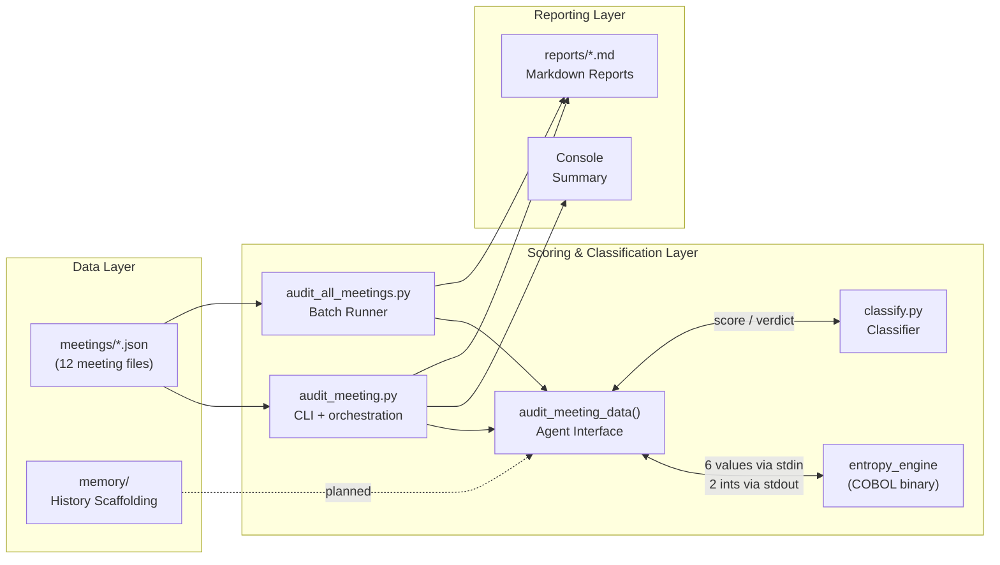
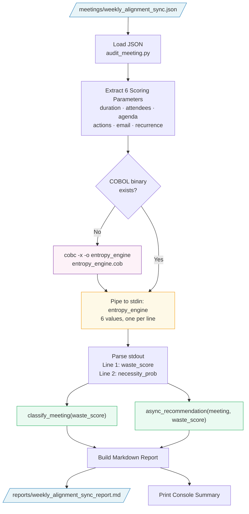
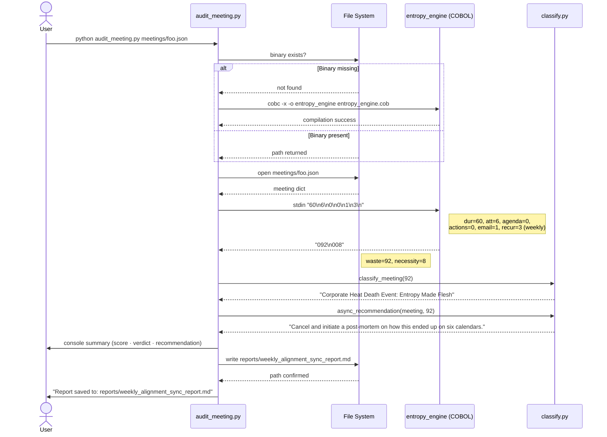
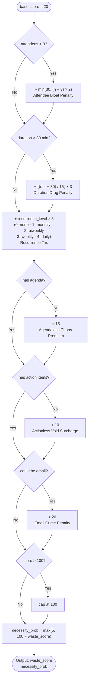
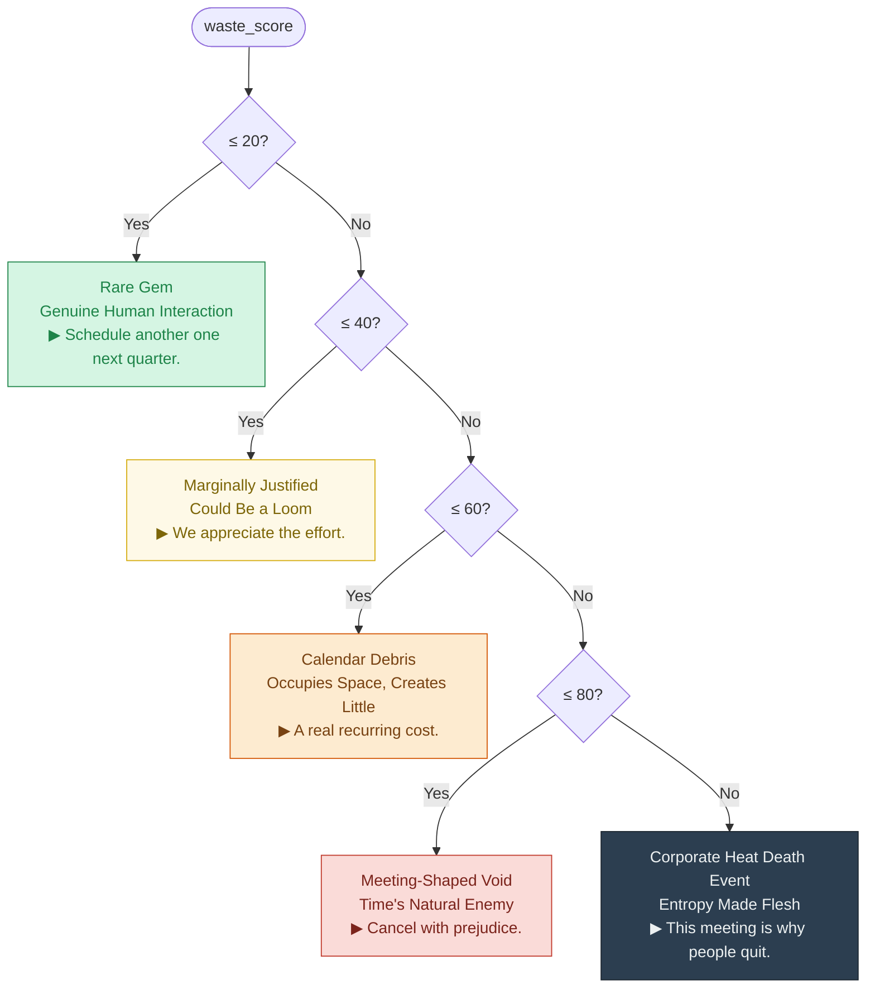
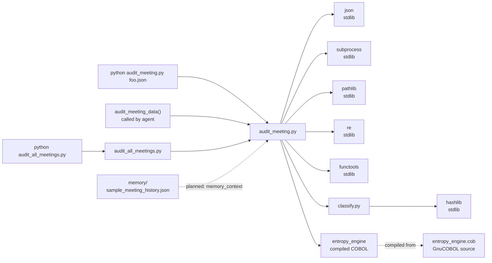

# SilentSpace Guardian — Architecture

A visual guide to how the system transforms meeting JSON into organizational verdicts.
For prose documentation and the scoring formula, see [docs/architecture.md](docs/architecture.md).

---

## 1. High-Level System Overview

Three layers. No network calls. One existential question per meeting.

---

## 2. Detailed Data Flow

---

## 3. Scoring Pipeline Sequence

---

## 4. COBOL Scoring Decision Tree

The entropy engine applies five additive penalties to a base score of 20,
then caps the result at 100.

---

## 5. Classification Tiers

---

## 6. Module Dependency Map

> **Zero third-party dependencies.** The entire Python layer uses only the standard library.
> The COBOL layer requires GnuCOBOL (`cobc`) at compile time only.
