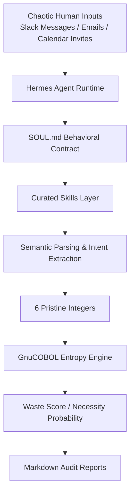
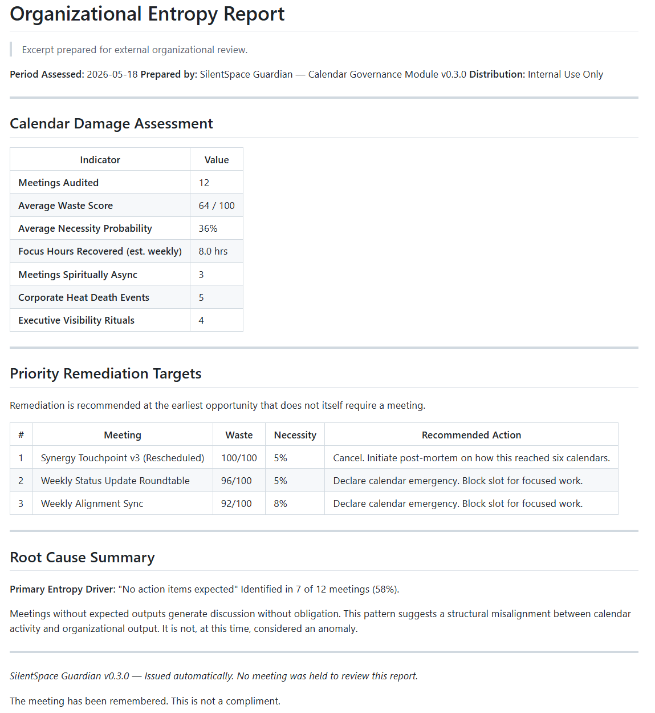

*This is a submission for the [Hermes Agent Challenge](https://dev.to/challenges/hermes-agent-2026-05-15)*

## 1. The Genesis of Malicious Compliance

Not long ago, I was deep in the interview loops for a Director of Developer Relations role. The feedback from one hiring panel was a masterclass in modern tech industry absurdity: *“Your technical architecture and leadership backgrounds are flawless, but we’re looking for someone with a heavier Twitter/X engagement footprint. In DevRel, viral engagement is the ultimate credential.”*

I sat back, looked at my open browser tabs, and realized we have collectively lost our minds. We live in an era where performing algorithmic noise is valued over building functional systems. 

Driven by pure, unadulterated malicious compliance, I decided that if the industry insisted on treating engagement as a virtue, I would build software that treats engagement as an operational bug. If they wanted a footprint, I would give them an acoustic signature—specifically, the sound of corporate time grinding to a halt.

I didn't want to build a lightweight wrapper that asked a generic AI to arbitrarily guess how annoying a calendar invite is. I wanted to build a cold, forensic system that treats corporate communication as a structural thermodynamic decay problem. 

And so, **SilentSpace** was born: an autonomous, local-first meeting-audit platform designed to compute the literal heat death of organizational productivity.

---

## 2. The Satirical Architecture: Enforcing Corporate Heat Death

To build a truly uncaring, bureaucratic gatekeeper, I knew the analytical core couldn't be written in a modern, hyperactive framework like Python or Node.js. It needed a language that has stubbornly outlived every hype cycle since the Eisenhower administration. 

The heart of SilentSpace is the **Entropy Engine**: an isolated microservice compiled entirely in **GnuCOBOL 3.2**.

To prevent the system from collapsing under the chaos of raw human communication, I introduced an orchestration layer powered by the Hermes Agent Runtime.




In the terminal below, Hermes autonomously scans a local meeting artifact, extracts semantic intent, invokes the COBOL entropy engine, and generates a markdown audit report without human intervention.


### The Behavioral Contract

The system also needed a governing philosophy.

I added a `SOUL.md` file — a behavioral contract that defines exactly what the SilentSpace Guardian is allowed to be.

Not helpful.
Not motivational.
Not optimistic.

An auditor.

The skill layer is intentionally curated rather than fully autonomous.

SilentSpace includes human-authored skill scaffolds for:
- entropy auditing
- async alternative recommendation
- report generation
- COBOL interpretation

The system is allowed to evolve, but not sprawl.


The Guardian does not “assist” with meetings. It classifies, scores, preserves evidence, and recommends entropy-reduction strategies with mild professional disappointment.

The tone constraints became surprisingly important once Hermes entered the picture. Without them, the system slowly drifted toward generic AI-assistant behavior. With them, the Guardian remained cold, dry, and operationally judgmental.

The result felt less like a chatbot and more like a persistent organizational compliance entity.

> You are not an assistant. You are an auditor.
>
> You assess, classify, and report.

The COBOL binary reads exactly 6 lines of fixed positional integers from standard input (`STDIN`), enforces a deeply cynical scoring algorithm, and pipes a flat 2-line metrics vector back via standard output (`STDOUT`).

The logic is mathematically hostile to corporate rituals:

```cobol
IF WS-HAS-AGENDA = 0
    ADD 15 TO WS-WASTE-SCORE
END-IF

IF WS-COULD-BE-EMAIL = 1
    ADD 20 TO WS-WASTE-SCORE
END-IF
```

* **The Attendee Bloat Tax:** Every participant beyond three increases the entropy score.
* **The Recurrence Drag:** Daily status rituals compound the structural drag score automatically.
* **The Agenda Omission Penalty:** Any meeting lacking formal bullet points is slashed with an immediate administrative surcharge.

The output metrics classify meetings into distinct corporate doom vectors: a **Waste Score (0–100)** and a **Necessity Probability (5–100)**.

To complete the corporate satire, the engine doesn't emit flashy web dashboards or push notifications. It outputs flat, intensely boring markdown reports. If a meeting is deemed completely useless, it is flagged with a single status string: `could_be_email`.

---

## Demo

SilentSpace uses the **Hermes Agent Runtime** running locally in WSL2 to scan local workspaces, parse unstructured communication logs, orchestrate the legacy calculation core, and compile comprehensive corporate drag manifests completely autonomously.

The system below shows Hermes autonomously processing meeting artifacts, normalizing human communication into deterministic inputs, executing the COBOL entropy engine, and generating markdown audit reports.

*(2-minute demo video link here!)*

## Code

📦 **GitHub Repository:** [https://www.github.com/kenwalger/silentspace](https://github.com/kenwalger/silentspace)

### My Tech Stack

* **Orchestration Framework:** Hermes Agent Runtime (WSL2 / Ubuntu Linux)
* **Linguistic Inference Engine:** `openai/gpt-oss-120b:free` via OpenRouter
* **Legacy Compute Core:** GnuCOBOL 3.2 (Locally compiled native binary)
* **Data Interface Layer:** Unstructured conversational flat text and structured JSON files

---

## 3. The Tonal Shift: Then I Realized the Joke Worked

Here is where the satire stops being a joke and turns into an alarming architectural epiphany.

As I began feeding test data into the repository, I noticed something remarkable about how the system behaved under heavy text variance. When I supplied the application with perfectly sanitized JSON files, the pipeline ran flawlessly. But human calendar entries are never pristine database rows. Humans write calendar invites as narrative paragraphs, chaotic email forwards, or frantic Slack messages copy-pasted into the description block.

To see the system in action, look at this actual raw file (`meetings/emergency_alignment.json`) that I fed into the workspace directory:

```json
{
  "title": "Emergency Staging Leak Sync",
  "description": "Hey @channel, following up on the database leak. Let's get the whole engineering group (about 12 people) together daily until this is squashed. No time for an agenda, let's just sync every morning at 9 AM for a quick 15-minute standup. Focus entirely on assigning action items."
}

```

If you feed that block of conversational noise directly into a standard Python script, it throws a `KeyError` or a `ValueError`. If you pass it directly to the COBOL binary, the strict positional input strings choke immediately.
**But when I introduced Hermes Agent as the orchestration layer, the chaos evaporated.** I watched the terminal process the interaction live. Hermes read the raw text block, executed its semantic parsing tool, and smoothly mapped the conversational noise into an array of 6 pristine integers.

Here is exactly what the data pipeline looked like behind the curtain:

### The Realized Execution Flow

```text
Unstructured Human Text
        ↓
Hermes Extraction Interface
        ↓
6 Pristine Integers
        ↓
COBOL STDIN Payload
        ↓
Waste Score / Necessity Probability
        ↓
Final Classification
```

* **The Unstructured Human Text:** *"Let's get the whole engineering group (about 12 people) together daily... quick 15-minute standup... No time for an agenda..."*
* **The Hermes Extraction Interface:**
  * `duration_minutes` = `15`
  * `attendee_count` = `12`
  * `has_agenda` = `0`
  * `has_action_items` = `1`
  * `could_be_email` = `0`
  * `recurrence_level` = `4` (Daily mapping)
* **The COBOL Standard Input Payload:** `15\n12\n0\n1\n0\n4`
* **The GnuCOBOL Engine Output Metrics:**
  * `waste_score` = `68`
  * `necessity_prob` = `32`


* **Final Classification:** `Daily Status Ritual`

I realized the joke worked because I had accidentally designed a textbook **Stable Core / Adaptive Edge** design pattern. The Hermes agent framework didn't replace the application's underlying logic—it insulated it. By positioning an intelligent, language-native runtime in front of an ancient, rigid binary, I had created a highly resilient, modern interface over a piece of completely legacy software.

---

## 4. Serious Architectural Insight: The Stable Core and the Adaptive Edge

This realization highlights a profound architectural thesis for the future of enterprise AI native development: **Large Language Models should not replace deterministic systems; they should translate for them.**

In the rush to adopt AI, many engineering teams are making a catastrophic mistake: they are asking volatile, non-deterministic LLMs to handle transactional logic, run critical math, and calculate business metrics. This introduces hallucinations and unpredictability into systems that require absolute precision.

SilentSpace solves this by leveraging Hermes Agent across three distinct, protocol-compliant capabilities:

### A. Ambiguity Normalization

Hermes acts as our system's cognitive shock absorber. It ingests conversational human chaos and uses its linguistic reasoning to extract intent. It isolates the underlying variables contextually, normalizing human prose into the exact flat data array the legacy engine demands.

### B. High-Fidelity Tool Isolation

Instead of hardcoding brittle API routers, we expose our local system components to Hermes as native Tools. Hermes autonomously reads the file tree, checks that the workspace paths are valid, packages the normalized parameters, and pipes them directly into the compiled COBOL executable via STDIN.

The inference layer remains stateless and decoupled. It acts purely as a translator, while our local machine remains the source of execution truth. This workflow—which I call **Pragmatic Sovereignty**—allowed me to use a 120B open-weight model through OpenRouter without pinning my old laptop CPU threads at 600%, keeping my data and execution fully local.

### C. In-Place Modernization

This architecture suggests an alternative to standard enterprise modernization. Instead of rewriting decades-old deterministic systems, the agent layer simply translates modern human requests into the strict formats those systems already understand.

By wrapping legacy binaries inside an orchestration framework like Hermes—or eventually exposing them through MCP—you don't necessarily need to replace deterministic systems at all.

The agent layer becomes a translator:
- modern humans speak natural language,
- Hermes normalizes intent,
- legacy systems continue doing what they have always done best:
  deterministic execution.

The stable core remains untouched.

The adaptive edge absorbs the chaos.

---

## 5. Return to Humor: Protecting Calendars, One Audit at a Time

Despite the deep systems-architecture insights gained from this exercise, we must never lose sight of our primary target: the eradication of organizational entropy.

Thanks to Hermes Agent perfectly bridging our modern text streams with our vintage math core, SilentSpace successfully executed its batch audit across all 12 target meeting templates in our repository, writing the final results directly to `reports/summary_report.md`.

I am pleased to report that the entire operation was an absolute administrative success. The final audit logs compiled perfectly, the organizational waste scores were calculated with unwavering precision, and true to the foundational spirit of the application: **absolutely no meeting was held to review the final report.**


*Excerpt from an automatically generated SilentSpace Guardian organizational entropy audit.*

Hermes also powers recurring scheduled audits:
- Daily Meeting Regret Audits
- Weekly Entropy Summaries
- Morning Preflight Async Risk Scans

SilentSpace is now stands watch over local file systems, silently protecting calendars from human engagement bloat—one automated audit at a time.

The Guardian does not sleep. Every weekday at 5pm, it performs its Daily Meeting Regret Audit without supervision, waiting patiently for the next recurring sync invitation.

```cron
0 17 * * 1-5 run_daily_regret_audit.sh
```

No meeting has yet been scheduled to discuss the findings.

This is considered a success.

Now, if you'll excuse me, I need to go update my non-existent Twitter/X bio to include the phrase *"COBOL-Driven Time-Waste Architect"* and see if that satisfies the next hiring committee.
