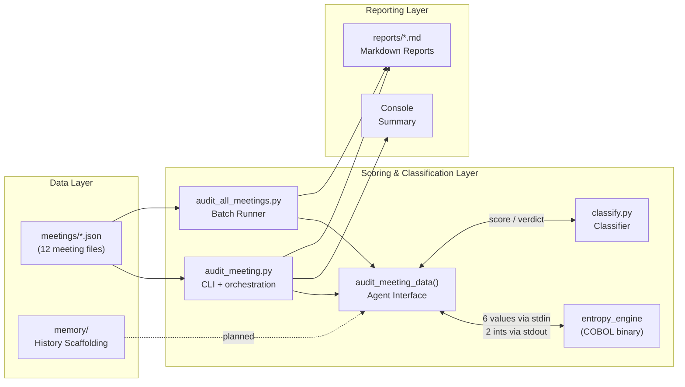
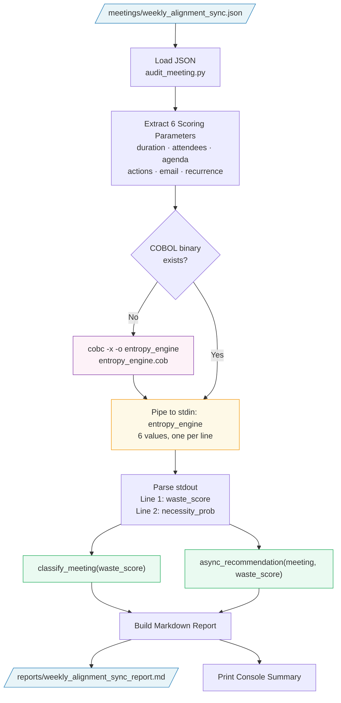
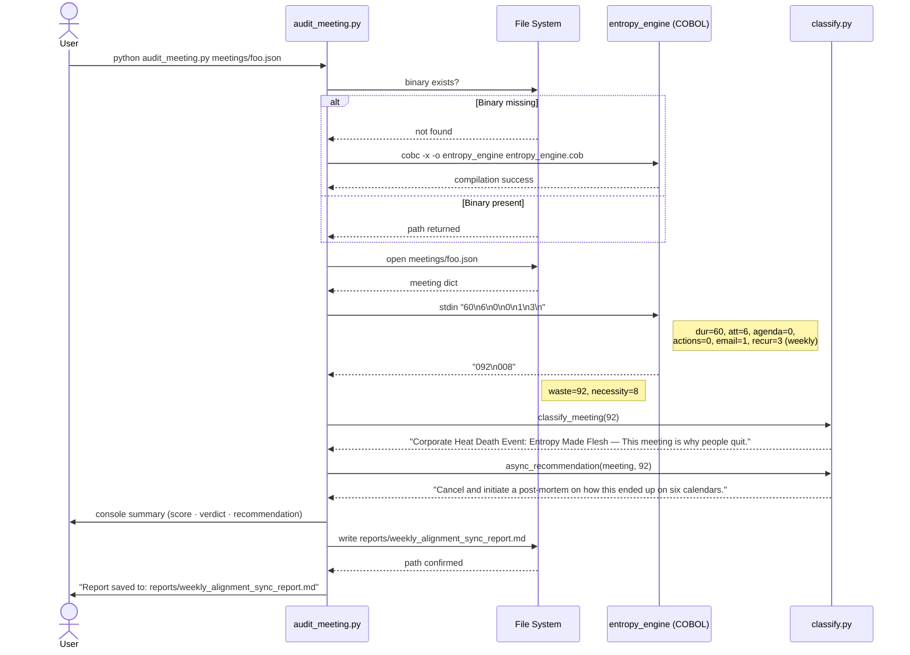
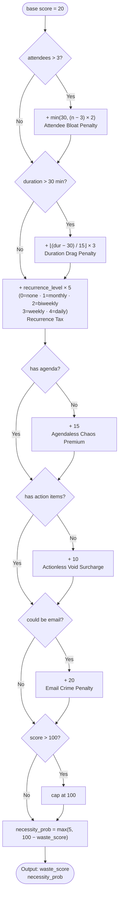
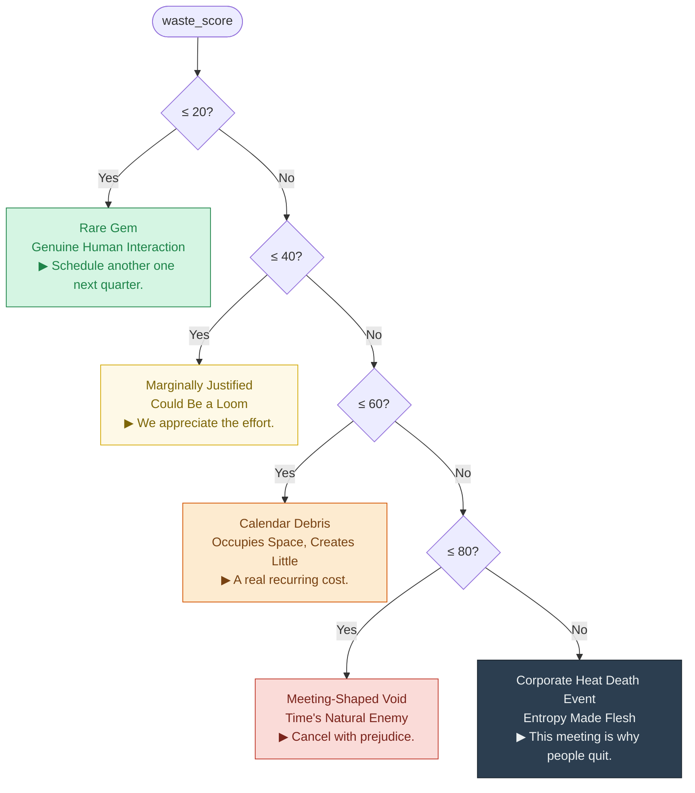
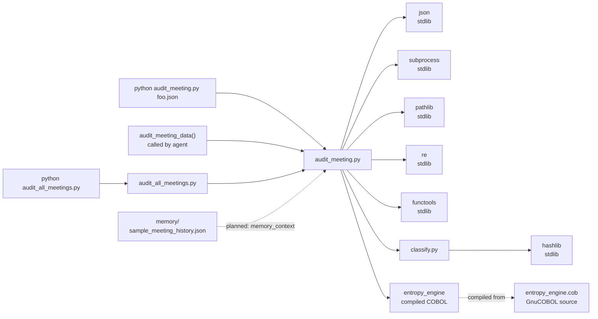

# SilentSpace Guardian — Architecture

## Overview

SilentSpace Guardian is a three-layer pipeline for meeting waste analysis:

1. **Data Layer** — Mocked meeting JSON files in `meetings/`
2. **Scoring Layer** — A COBOL entropy engine (`cobol/entropy_engine.cob`)
3. **Reporting Layer** — Python wrapper, classifier, and Markdown output

## Data Flow

```
meetings/<name>.json
        │
        ▼
python/audit_meeting.py  ──  load_meeting() + audit_meeting_data()
   ├── 1. Load and parse JSON
   ├── 2. Extract 6 scoring parameters
   ├── 3. Pipe to stdin: cobol/entropy_engine (6 values, one per line)
   │              └── stdout: two integers (waste_score, necessity_prob)
   ├── 4. python/classify.py → classification label + async recommendation
   └── 5. Write: reports/<meeting_slug>_report.md
```

---

## COBOL Scoring Engine

**Source:** `cobol/entropy_engine.cob`
**Compiled binary:** `cobol/entropy_engine` (or `entropy_engine.exe` on Windows)
**Compiler:** GnuCOBOL (`cobc`)

### Input — stdin (6 values, one per line)

| Line | Parameter | Type | Values |
|---|---|---|---|
| 1 | `duration_minutes` | integer | Meeting length in minutes |
| 2 | `attendee_count` | integer | Number of attendees |
| 3 | `has_agenda` | 0 or 1 | 1 = agenda distributed |
| 4 | `has_action_items` | 0 or 1 | 1 = action items expected |
| 5 | `could_be_email` | 0 or 1 | 1 = this is an email |
| 6 | `recurrence_level` | 0–4 | none=0 monthly=1 biweekly=2 weekly=3 daily=4 |

### Scoring Formula

```
waste_score = 20                                       (base organizational entropy)
```

**Attendee Bloat Penalty** (capped at 30):
```
+ min(30, (attendee_count - 3) × 2)    if attendee_count > 3
```

**Duration Drag Penalty:**
```
+ ((duration_minutes - 30) / 15) × 3  if duration_minutes > 30
```
Integer division. A 60-min meeting adds 6. A 2-hour meeting adds 18.

**Recurrence Tax:**
```
+ recurrence_level × 5
```
none=+0, monthly=+5, biweekly=+10, weekly=+15, daily=+20

**Behavioral Penalties:**
```
+ 15 if has_agenda = 0       (agendaless chaos premium)
+ 10 if has_action_items = 0 (actionless void surcharge)
+ 20 if could_be_email = 1   (email crime penalty)
```

**Cap:** `waste_score` is clamped to [0, 100].

**Necessity Probability:**
```
necessity_prob = max(5, 100 - waste_score)
```
No meeting is entirely without hope. Minimum 5%.

### Output

Two integers on separate stdout lines:

```
095
005
```

Line 1 = waste_score, Line 2 = necessity_prob.

---

## Python Layer

### `python/audit_meeting.py`

Entry point and agent-callable interface. Responsibilities:

1. **Auto-compilation** — compiles `entropy_engine.cob` on first run if binary is absent
2. **JSON loading** — reads the meeting file from the given path (`load_meeting`)
3. **Agent interface** — `audit_meeting_data(meeting, memory_context=None) -> dict` accepts a meeting dict directly, validates required fields (`title`, `duration_minutes`, `attendees`), runs the full scoring pipeline, and returns a structured result; no file I/O required. Raises `ValueError` listing all missing fields if any required field is absent.
4. **Parameter extraction** — maps JSON fields to 6 stdin values for the COBOL binary; required fields use direct key access, optional fields (`has_agenda`, `has_action_items`, `could_be_email`, `recurrence`) use safe defaults
5. **Subprocess call** — invokes the COBOL binary, pipes parameters via stdin, captures stdout
6. **Output parsing** — reads two integer lines from stdout
7. **CLI error handling** — `main()` catches `ValueError` from `audit_meeting_data()` and prints a readable `ERROR:` message to stderr before exiting with code 1; no raw traceback is shown to the user
8. **Printing** — formatted console summary (CLI path only)
9. **Report generation** — calls `classify.py`, assembles Markdown
10. **File write** — saves to `reports/<slug>_report.md` (CLI path only)

### `python/classify.py`

Provides two pure functions:

- `classify_meeting(waste_score: int) -> str`
  Maps waste_score to one of five classification tiers.

- `async_recommendation(meeting: dict, waste_score: int) -> str`
  Returns a deterministic async alternative based on the meeting's title hash.
  Same meeting always gets the same recommendation. No randomness.

---

## Meeting JSON Schema

```json
{
  "title": "string",
  "recurrence": "none | monthly | biweekly | weekly | daily",
  "duration_minutes": 60,
  "attendees": ["Name or Role", "..."],
  "has_agenda": false,
  "has_action_items": false,
  "could_be_email": true,
  "organizer": "email or name",
  "description": "One-line flavor text for the report"
}
```

---

## Classification Tiers

| Waste Score | Classification |
|---|---|
| 0–20 | Rare Gem: Genuine Human Interaction |
| 21–40 | Marginally Justified: Could Be a Loom |
| 41–60 | Calendar Debris: Occupies Space, Creates Little |
| 61–80 | Meeting-Shaped Void: Time's Natural Enemy |
| 81–100 | Corporate Heat Death Event: Entropy Made Flesh |

---

## Agent Tool Boundary

`audit_meeting_data` is the intended integration point for agent frameworks.
It accepts a meeting dictionary and returns a structured result with no file
I/O, no side effects, and no console output.

```python
import sys
sys.path.insert(0, "python")   # audit_meeting.py imports classify from the same directory
from audit_meeting import audit_meeting_data

result = audit_meeting_data(
    meeting={
        "title": "Weekly Alignment Sync",
        "recurrence": "weekly",
        "duration_minutes": 60,
        "attendees": ["Alice", "Bob", "Carol", "Dave", "Eve", "Frank"],
        "has_agenda": False,
        "has_action_items": False,
        "could_be_email": True,
        "organizer": "alice@corp.com",
        "description": "...",
    }
)
# result["waste_score"]    → int
# result["necessity_prob"] → int
# result["classification"] → str
# result["recommendation"] → str
# result["meeting"]        → dict (original input)
```

The `memory_context` parameter is accepted but not yet used. It is the
placeholder for context passed in by Hermes — conversation history, user
preferences, prior audit results — so the function signature is stable
before integration begins.

The CLI commands (`audit_meeting.py`, `audit_all_meetings.py`) call this
function internally. They add file loading, console output, and Markdown
report writing on top of it; none of that is part of the callable interface.

---

## Constraints (Intentional)

The following are explicitly out of scope for this iteration:

| Category | Excluded |
|---|---|
| External services | Google Calendar, Outlook, Slack, OAuth |
| Persistence | Databases, cloud storage |
| Infrastructure | Docker, Kubernetes, CI/CD pipelines |
| Application layer | Web server, REST API, UI |
| Networking | Any HTTP calls of any kind |

The entire system runs locally with no network access.

## Road to Production

| Dimension      | Demo (v0.1.0)     | Production Path                                  |
|----------------|-------------------|--------------------------------------------------|
| Calendar Input | Mocked JSON files | Google Calendar/ Outlook via OAuth 2.0           |
| Authentication | None              | OAuth per user, scoped read-only calendar access |
| Persistence | None (file system only) | SQLite or Postgres for audit history and recurrence tracking |
| Hermes memory | `memory_context` placeholder | Live context from `MEMORY.md` / prior audit results |
| Notifications | Markdown reports | Slack webhook and/or email digest | 
| Deployment | Local only | $5 VPS, systemd service, or serverless |
| Networking | Zero HTTP calls | Calendar API, notification webhooks |

---

## Visual Diagrams

The diagrams below render on GitHub. For a plain-text data flow, see the
[Data Flow](#data-flow) section above.

### 1. High-Level System Overview

Three layers. No network calls. One existential question per meeting.



### 2. Detailed Data Flow



### 3. Scoring Pipeline Sequence



### 4. COBOL Scoring Decision Tree

The entropy engine applies five additive penalties to a base score of 20,
then caps the result at 100.



### 5. Classification Tiers



### 6. Module Dependency Map



> **Zero third-party dependencies.** The entire Python layer uses only the standard library.
> The COBOL layer requires GnuCOBOL (`cobc`) at compile time only.
